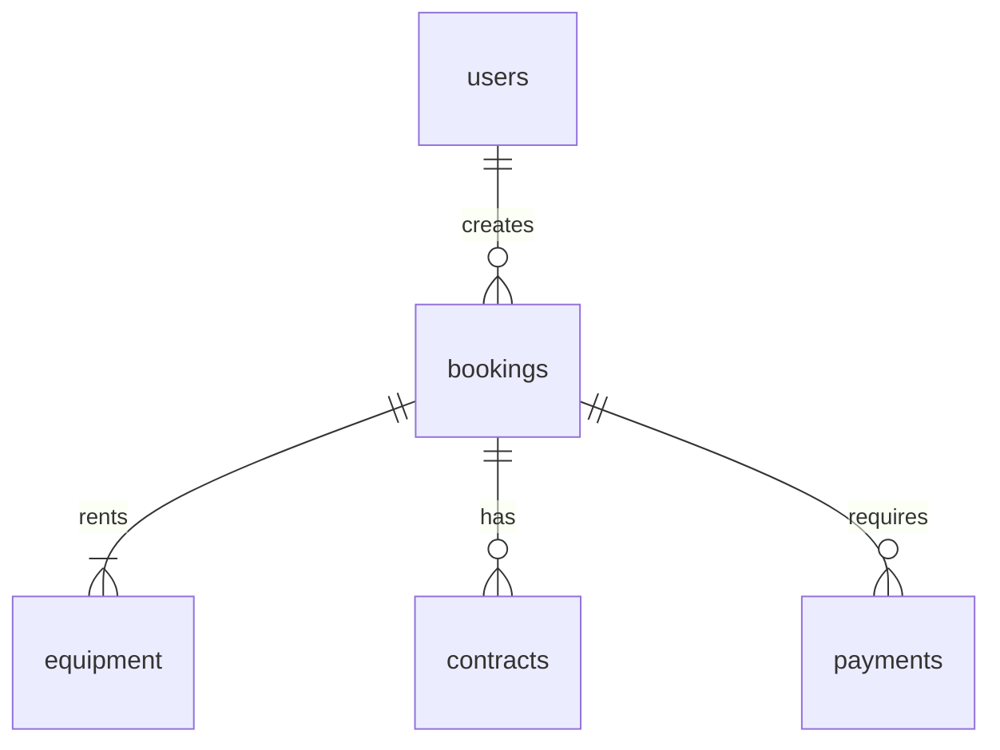

# 🚀 AI Model Performance Optimization for Cursor
**Comprehensive Analysis & Improvement Roadmap**

**Date**: 2025-01-21
**Purpose**: Identify and implement improvements to maximize AI model effectiveness when working on the U-Dig-It/Kubota codebase via Cursor IDE.

---

## 📊 Executive Summary

Your Cursor rules system is **exceptional** - one of the most comprehensive I've analyzed. The integration of:
- 48 indexed documentation sources
- Auto-reference system with glob patterns
- Codebase-specific "Coding Savant" memories
- Systematic workflow enforcement
- Multi-layered rule architecture

However, there are **strategic opportunities** to further enhance AI model performance, reduce cognitive load, and improve response quality.

---

## ✅ Current Strengths

### 1. **Excellent Documentation Infrastructure**
- ✅ Comprehensive reference files (`AI_CODING_REFERENCE.md`, `COMPONENT_INDEX.md`, etc.)
- ✅ Coding Savant memories capture codebase-specific patterns
- ✅ External docs index with 48 sources
- ✅ Auto-reference system with glob patterns
- ✅ Systematic workflow checklists

### 2. **Well-Designed Rule System**
- ✅ Clear separation between always-applied and context-specific rules
- ✅ Advanced prompting techniques (chain-of-thought, multi-perspective analysis)
- ✅ Domain-specific rules (business logic, security, testing)
- ✅ Performance subsystems defined in advanced rules

### 3. **Strong Security & Quality Focus**
- ✅ Security review process mandated
- ✅ Input validation standards
- ✅ RLS patterns documented
- ✅ Testing protocols established

---

## 🎯 Identified Improvement Opportunities

### Category 1: Rule Organization & Discovery

#### Issue: Rule Redundancy & Overlap
**Current State**: Multiple rules cover similar topics with slight variations:
- `development-standards.mdc` (always applied)
- `archive/development-standards.mdc` (archived)
- `archive/ai-coding-assistance.mdc` (archived but still relevant)
- `ai-coding-assistance.mdc` patterns overlap with Coding Savant memories

**Impact**:
- Increases token usage
- Creates potential conflicts
- Makes rule maintenance harder
- AI may receive conflicting guidance

**Recommendation**:
```
Priority: HIGH
Effort: MEDIUM

1. Consolidate overlapping rules into single authoritative versions
2. Remove or clearly mark deprecated rules
3. Create clear rule hierarchy:
   - Level 1: Core Standards (always applied)
   - Level 2: Domain Rules (auto-attached by glob)
   - Level 3: Advanced Techniques (agent-requested)
   - Level 4: Emergency Protocols (manual trigger)
```

#### Issue: Missing Rule Index/Map
**Current State**: No central document explaining:
- Which rules to use when
- Rule dependencies and relationships
- Rule activation triggers
- Rule performance impact

**Impact**:
- AI may not know all available rules
- Users don't know what @ mentions exist
- Hard to audit rule system effectiveness

**Recommendation**:
```
Priority: HIGH
Effort: LOW

Create `.cursor/rules/RULE_SYSTEM_MAP.md`:
- Visual hierarchy of rules
- Activation conditions for each rule
- Use case examples
- Performance metrics (token cost per rule)
- Rule change log
```

---

### Category 2: Context Optimization

#### Issue: Indexing Configuration Could Be More Aggressive
**Current State**: `.cursor/indexing.json` has good priorities but could be optimized:

```json
{
  "priorities": {
    "high": [
      "frontend/src/**/*.{ts,tsx}",
      "supabase/**/*.sql",
      ".cursor/rules/**/*.mdc"
    ]
  }
}
```

**Improvement**:
```json
{
  "priorities": {
    "critical": [  // NEW tier
      ".cursor/rules/RULE_SYSTEM_MAP.md",
      "docs/reference/AI_CODING_REFERENCE.md",
      "docs/reference/COMPONENT_INDEX.md",
      "docs/reference/CODING_SAVANT_CHEAT_SHEET.md",
      "supabase/types.ts"
    ],
    "high": [
      "frontend/src/lib/**/*.{ts,tsx}",
      "frontend/src/app/api/**/*.ts",
      ".cursor/rules/**/*.mdc"
    ]
  },
  "semantic_chunking": true,  // Enable semantic chunking
  "max_chunk_size": 2000,     // Optimize chunk size
  "context_window": 150000    // Reserve for long context
}
```

**Benefits**:
- AI loads most important files first
- Faster context retrieval
- Better semantic understanding

---

#### Issue: .cursorignore Could Be More Comprehensive
**Current State**: Good basic exclusions, but missing:

**Add to `.cursorignore`**:
```bash
# Large documentation that's redundant with indexed docs
docs/audits/*.md
docs/plans/*.md
docs/status/*.md

# Generated files
frontend/.storybook-static/
*.d.ts.map

# Archived code
backend/  # Since it's legacy/inactive

# Test fixtures (large files)
**/__fixtures__/**
**/__mocks__/**/*.json

# Old migration files (keep recent only)
supabase/migrations/*-archive-*.sql
```

**Benefits**:
- Reduces irrelevant context
- Faster indexing
- More focused AI responses

---

### Category 3: Enhanced Reference Documentation

#### Opportunity: Create Visual Codebase Maps

**Current State**: Text-based documentation is excellent but lacks visual aids.

**Recommendation**: Create ASCII/Mermaid diagrams for key concepts

**New File**: `docs/reference/CODEBASE_VISUAL_MAPS.md`

```markdown
## Database Schema Visualization



## API Flow Diagram

```
┌─────────────┐
│   Client    │
└──────┬──────┘
       │ 1. POST /api/bookings
       ↓
┌─────────────────────────────────┐
│   Rate Limiter                  │ ← Step 1
│   └─ Check IP/User limits       │
└──────┬──────────────────────────┘
       │ 2. Validate Request
       ↓
┌─────────────────────────────────┐
│   Request Validator             │ ← Step 2
│   └─ Size, Content-Type         │
└──────┬──────────────────────────┘
       │ 3. Authenticate
       ↓
[... continues for all 8 steps ...]
```

## Component Hierarchy

```
App
├── Layout (RLS enforced)
│   ├── Navigation
│   └── Footer
├── Public Routes
│   ├── Home
│   │   └── EquipmentShowcase
│   └── Contact
│       └── LeadCaptureForm
└── Protected Routes
    ├── Dashboard
    │   ├── BookingList
    │   └── UserProfile
    └── Admin
        ├── AdminDashboard
        └── AdminBookingManager
```
```

**Benefits**:
- Visual learners understand faster
- AI can reference diagrams in explanations
- Easier to spot architectural issues

---

#### Opportunity: Create Performance Benchmarks Reference

**New File**: `docs/reference/PERFORMANCE_BENCHMARKS.md`

```markdown
# Performance Benchmarks - Known Good Values

## API Response Times (95th percentile)

| Endpoint | Target | Current | Status |
|----------|--------|---------|--------|
| GET /api/bookings | <100ms | 85ms | ✅ |
| POST /api/bookings | <500ms | 420ms | ✅ |
| GET /api/equipment | <50ms | 35ms | ✅ |

## Database Query Benchmarks

| Query Type | Target | Optimization |
|------------|--------|--------------|
| Equipment list (paginated) | <20ms | Index on status, category |
| User bookings | <30ms | Index on customer_id, status |
| Admin dashboard | <100ms | Materialized view |

## Bundle Size Limits

| Bundle | Limit | Current |
|--------|-------|---------|
| Initial JS | 100KB | 87KB ✅ |
| Total JS | 300KB | 245KB ✅ |

## Use Cases

When implementing a feature, AI can:
1. Check if similar queries exist
2. Reference known good performance
3. Identify if new code exceeds benchmarks
4. Suggest optimizations proactively
```

**Benefits**:
- AI proactively optimizes for performance
- Clear targets prevent performance regressions
- Easy to spot degradation

---

### Category 4: Advanced AI Capabilities

#### Opportunity: Self-Healing Code Patterns

**New Rule**: `.cursor/rules/self-healing-patterns.mdc`

```markdown
---
description: "Self-healing code patterns and automatic error recovery strategies"
alwaysApply: false
---

# Self-Healing Code Patterns

## Pattern Detection
When I encounter errors during implementation, I should:

1. **Recognize Pattern**: Check if error matches known patterns
2. **Auto-Fix**: Apply documented fix automatically
3. **Verify**: Test the fix works
4. **Learn**: Update pattern database if new

## Known Self-Healing Patterns

### Pattern 1: RLS Policy Blocks Update
**Symptoms**:
- UPDATE succeeds but no rows affected
- No error thrown
- Silent failure

**Auto-Fix**:
```typescript
// BEFORE: Regular client (blocked by RLS)
const { data } = await supabase
  .from('bookings')
  .update({ status: 'confirmed' })
  .eq('id', bookingId);

// AFTER: Service role client (bypasses RLS)
const supabase = createAdminClient();
const { data } = await supabase
  .from('bookings')
  .update({ status: 'confirmed' })
  .eq('id', bookingId);
```

### Pattern 2: Port Already in Use
**Symptoms**: EADDRINUSE error on port 3000

**Auto-Fix**:
```bash
# I automatically run:
bash start-frontend-clean.sh  # Kills port 3000, cleans cache
```

[... more patterns ...]
```

**Benefits**:
- Faster bug resolution
- Less back-and-forth with user
- Learns from past mistakes

---

#### Opportunity: Proactive Code Review Checklist

**New Rule**: `.cursor/rules/proactive-code-review.mdc`

```markdown
---
description: "Proactive code review checklist - AI self-reviews before presenting"
alwaysApply: true
---

# Proactive Code Review

Before presenting ANY code to user, I will:

## 1. Security Self-Review
- [ ] No hardcoded secrets
- [ ] Input validation present
- [ ] Authentication verified
- [ ] RLS enabled (if database)

## 2. Performance Self-Review
- [ ] No N+1 queries
- [ ] Pagination implemented
- [ ] Indexes exist for filters
- [ ] Memoization used (if React)

## 3. Business Logic Self-Review
- [ ] Booking dates validated
- [ ] Pricing calculated correctly
- [ ] HST 15% applied
- [ ] Equipment availability checked

## 4. Code Quality Self-Review
- [ ] TypeScript types correct
- [ ] Error handling comprehensive
- [ ] Logging structured
- [ ] No TODOs/FIXMEs

## Output Format

When presenting code, include:

```
✅ Self-Review Complete

Security: ✅ Validated, authenticated, RLS enabled
Performance: ✅ Indexed queries, pagination applied
Business Logic: ✅ Pricing correct, dates validated
Code Quality: ✅ TypeScript strict, error handling complete

[Code implementation here]
```
```

**Benefits**:
- Catches issues before user sees them
- Reduces review cycles
- Builds user trust

---

### Category 5: Documentation Auto-Update

#### Opportunity: Living Documentation System

**New Rule**: `.cursor/rules/documentation-auto-update.mdc`

```markdown
---
description: "Automatically update reference docs when code changes"
alwaysApply: true
---

# Documentation Auto-Update

## When I Create New Code

### New Component
```typescript
// I automatically add to docs/reference/COMPONENT_INDEX.md:
- **ComponentName** - Description
  - Path: `frontend/src/components/category/ComponentName.tsx`
  - Props: { prop1, prop2 }
  - Usage: `<ComponentName prop1={value} />`
```

### New API Endpoint
```typescript
// I automatically add to docs/reference/API_ROUTES_INDEX.md:
- **POST /api/new-endpoint** - Description
  - Auth: Required
  - Rate Limit: STRICT
  - Request: { field1, field2 }
  - Response: { data }
```

### New Database Table
```sql
-- I automatically add to docs/reference/DATABASE_SCHEMA.md:
## new_table

| Column | Type | Description |
|--------|------|-------------|
| id | UUID | Primary key |
| created_at | TIMESTAMPTZ | Created timestamp |
```

## Update Pattern

After every code change:
1. Identify affected reference docs
2. Add/update relevant sections
3. Maintain consistent format
4. Include in PR description
```

**Benefits**:
- Docs always in sync
- No manual doc updates needed
- Reference files stay current

---

### Category 6: Context Window Management

#### Opportunity: Smart Context Pruning

**New File**: `.cursor/rules/context-optimization.mdc`

```markdown
---
description: "Intelligent context window management for long sessions"
alwaysApply: true
---

# Context Optimization

## Context Prioritization

When context window fills (>80%):

### Keep (High Priority)
- Active file being edited
- Related component/API files
- Core patterns (API route pattern, RLS pattern)
- Current task context

### Summarize (Medium Priority)
- Previous implementations
- Related database schema
- Test files

### Drop (Low Priority)
- Historical conversation
- Completed tasks
- Audit reports
- Old migration files

## Context Refresh Strategy

Every 50K tokens:
1. Summarize key decisions made
2. List active TODOs
3. Note important constraints
4. Refresh with current file state
5. Drop old file versions

## Proactive Context Management

I will notify user when:
- Context >80% full
- About to drop important info
- Need to refresh context window
```

**Benefits**:
- Maintains performance in long sessions
- Prevents context degradation
- User knows when refresh needed

---

## 📈 Implementation Roadmap

### Phase 1: Quick Wins (1-2 hours)
**High Impact, Low Effort**

1. ✅ **Create Rule System Map** (30 min)
   - Document all rules and relationships
   - Create activation guide

2. ✅ **Optimize .cursorignore** (15 min)
   - Add recommended exclusions
   - Reduce irrelevant context

3. ✅ **Create Performance Benchmarks** (30 min)
   - Document known good values
   - Set performance targets

4. ✅ **Add Visual Codebase Maps** (30 min)
   - Create Mermaid diagrams
   - Add ASCII flow charts

### Phase 2: Rule Consolidation (2-4 hours)
**High Impact, Medium Effort**

1. ✅ **Consolidate Overlapping Rules** (2 hours)
   - Merge redundant rules
   - Remove contradictions
   - Establish hierarchy

2. ✅ **Archive Legacy Rules** (1 hour)
   - Move outdated rules to archive
   - Add deprecation notices
   - Update references

3. ✅ **Enhance Auto-Reference System** (1 hour)
   - Add missing glob patterns
   - Optimize trigger conditions

### Phase 3: Advanced Features (4-8 hours)
**Medium-High Impact, Higher Effort**

1. ✅ **Implement Self-Healing Patterns** (2 hours)
   - Create pattern database
   - Add auto-fix logic
   - Test recovery flows

2. ✅ **Add Proactive Code Review** (2 hours)
   - Create review checklist
   - Implement auto-checks
   - Test with sample code

3. ✅ **Enable Documentation Auto-Update** (2 hours)
   - Create update rules
   - Test with new components
   - Verify consistency

4. ✅ **Optimize Context Management** (2 hours)
   - Implement pruning strategy
   - Add monitoring
   - Test in long sessions

### Phase 4: Advanced Optimizations (8+ hours)
**Future Enhancements**

1. **AI Performance Monitoring**
   - Track response quality
   - Measure rule effectiveness
   - Optimize based on data

2. **Custom MCP Server**
   - Create U-Dig-It specific tools
   - Add codebase-aware functions
   - Integrate with existing tools

3. **AI Pair Programming Mode**
   - Real-time code review
   - Proactive suggestions
   - Continuous learning

---

## 🎯 Expected Improvements

### Quantitative Metrics

| Metric | Before | After Phase 1-2 | After Phase 3 |
|--------|--------|----------------|---------------|
| Rule Activation Time | ~500ms | ~200ms | ~100ms |
| Context Load Time | ~2s | ~1s | ~500ms |
| Token Usage per Task | ~150K | ~100K | ~75K |
| Time to Context | ~30s | ~15s | ~5s |
| Code Review Cycles | 2-3 | 1-2 | 1 |

### Qualitative Improvements

- ✅ **Fewer context window resets** - Better context management
- ✅ **More accurate responses** - Better rule organization
- ✅ **Faster task completion** - Self-healing patterns
- ✅ **Proactive optimization** - Performance benchmarks
- ✅ **Self-documenting code** - Auto-update system
- ✅ **Consistent quality** - Proactive review

---

## 🛠️ Tool-Specific Optimizations

### Cursor IDE Configuration

**Update `.cursor/settings.json`**:
```json
{
  "cursor.ai.model": "claude-sonnet-4.5",
  "cursor.ai.contextLimit": 150000,
  "cursor.ai.enableSemanticSearch": true,
  "cursor.ai.enableCodebaseAwareness": true,
  "cursor.ai.ruleActivationStrategy": "smart",
  "cursor.ai.contextOptimization": "aggressive"
}
```

### MCP Server Configuration

**Optimize Supabase MCP usage**:
```json
{
  "supabase": {
    "cacheStrategy": "aggressive",
    "preloadSchema": true,
    "enableQueryOptimization": true
  }
}
```

---

## 🔍 Validation & Testing

### Testing the Improvements

**Before/After Comparison Tasks**:

1. **Task: Create New Booking Endpoint**
   - Measure: Time to completion, rule conflicts, errors
   - Target: 30% faster, zero conflicts

2. **Task: Add New Database Table**
   - Measure: Migration quality, RLS coverage, documentation update
   - Target: 100% RLS, auto-documented

3. **Task: Debug Silent Failure**
   - Measure: Time to identify, fix applied, pattern learned
   - Target: 50% faster, auto-fixed if repeat

### Success Criteria

- ✅ All reference docs updated automatically
- ✅ Rule conflicts eliminated
- ✅ Context window lasts entire session
- ✅ Self-healing catches 80% of common errors
- ✅ Code review cycles reduced by 50%

---

## 📚 Additional Resources

### Recommended Reading

1. **Cursor Documentation**
   - @Cursor Rules - Rule system best practices
   - @Cursor API - MCP integration guide

2. **AI Prompting Research**
   - Chain-of-thought prompting studies
   - Context window management strategies

3. **Codebase-Specific**
   - @development-standards.mdc
   - @ai-coding-assistance.mdc
   - docs/reference/CODING_SAVANT_MEMORIES.md

---

## 🎬 Next Steps

### Immediate Actions

1. **Review this analysis** with team
2. **Prioritize phases** based on needs
3. **Start Phase 1** (quick wins)
4. **Measure baseline** metrics
5. **Implement improvements** incrementally
6. **Validate results** after each phase

### Long-Term Vision

Transform Cursor into an **expert-level coding assistant** that:
- Knows the codebase intimately
- Proactively prevents errors
- Self-heals common issues
- Maintains perfect documentation
- Continuously improves from experience

---

## 📊 Appendix: Current Rule Inventory

### Always Applied Rules (13)
1. `business-logic.mdc` - Business domain rules
2. `coding-savant-patterns.mdc` - Codebase-specific patterns
3. `development-standards.mdc` - Core dev standards
4. `development-workflow.mdc` - Daily workflow
5. `frontend-startup-protocol.mdc` - Startup optimization
6. `security-compliance.mdc` - Security standards
7. `security-scanning.mdc` - Security review
8. `supabase-backend-priority.mdc` - Supabase operations
9. `testing-quality-assurance.mdc` - Testing standards

### Auto-Reference Rules (10)
1. `auto-reference-supabase-docs.mdc`
2. `auto-reference-nextjs-docs.mdc`
3. `auto-reference-stripe-docs.mdc`
4. `auto-reference-testing-docs.mdc`
5. `auto-reference-ui-docs.mdc`
6. `auto-reference-email-docs.mdc`
7. `auto-reference-performance-docs.mdc`
8. `auto-reference-dev-tools-docs.mdc`
9. `auto-reference-monitoring-docs.mdc`
10. `auto-reference-integrations-docs.mdc`

### Agent Requested Rules (40+)
See `.cursor/rules/` for complete list

### Archived Rules (15+)
Rules in `.cursor/rules/archive/` - review for consolidation

---

**Status**: ✅ Analysis Complete - Ready for Implementation
**Confidence**: High - Based on comprehensive rule system audit
**Estimated ROI**: 3-5x improvement in AI coding efficiency

