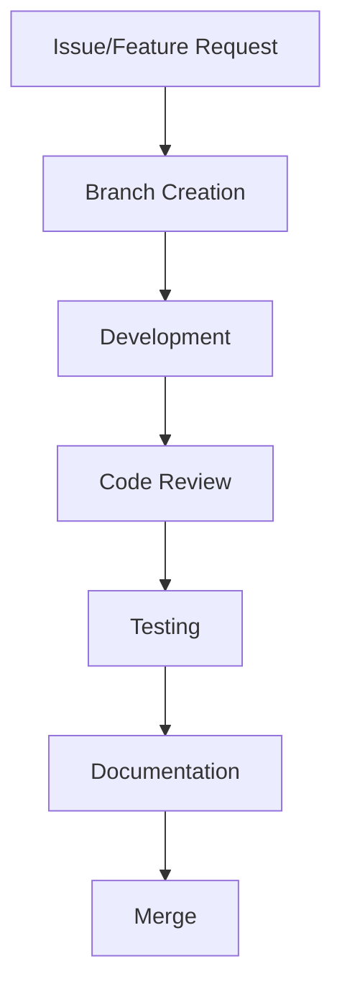

# Development Workflow & Code Quality Standards

## 🎯 Overview

This document establishes the development workflow, code quality standards, and maintenance procedures for the Kubota Rental Platform. Our goal is to maintain a clean, functional, and well-documented codebase that scales with the project.

## 🏗️ Development Philosophy

### Core Principles

1. **Quality First**: Every commit must improve code quality and maintainability
2. **Documentation Driven**: Code should be self-documenting with comprehensive README files
3. **Automated Testing**: All features must have corresponding tests
4. **Security by Design**: Security considerations in every architectural decision
5. **Performance Optimized**: Fast, responsive, and resource-efficient applications

## 📋 Development Workflow

### 1. Feature Development Process



#### Branch Naming Convention
- `feature/feature-name` - New features
- `bugfix/issue-description` - Bug fixes
- `hotfix/critical-issue` - Critical production fixes
- `refactor/component-name` - Code refactoring
- `docs/documentation-update` - Documentation updates

#### Commit Message Format
```
<type>(<scope>): <description>

[optional body]

[optional footer]
```

Types: `feat`, `fix`, `docs`, `style`, `refactor`, `test`, `chore`

### 2. Code Review Guidelines

#### Mandatory Checks
- [ ] TypeScript compilation passes
- [ ] ESLint rules satisfied
- [ ] Tests pass (unit + integration)
- [ ] Documentation updated
- [ ] Security review completed
- [ ] Performance impact assessed

#### Review Questions
- Does this change maintain backward compatibility?
- Are there any security implications?
- Is error handling comprehensive?
- Are there corresponding tests?
- Is the code well-documented?
- Does it follow established patterns?

### 3. Testing Strategy

#### Testing Levels
1. **Unit Tests** - Individual functions and methods
2. **Integration Tests** - Component interactions
3. **E2E Tests** - Complete user journeys
4. **Performance Tests** - Load and stress testing
5. **Security Tests** - Vulnerability scanning

#### Test Coverage Requirements
- Minimum 80% overall coverage
- 90% coverage for critical business logic
- 100% coverage for authentication/authorization
- All API endpoints must have tests

## 🔧 Code Quality Standards

### TypeScript Best Practices

#### Strict Mode Configuration
```typescript
// tsconfig.json
{
  "compilerOptions": {
    "strict": true,
    "noImplicitAny": true,
    "strictNullChecks": true,
    "strictFunctionTypes": true,
    "noImplicitReturns": true,
    "noUnusedLocals": true,
    "noUnusedParameters": true
  }
}
```

#### Type Definitions
- Use `interface` for object types
- Use `type` for union types and mapped types
- Avoid `any` - use proper type assertions
- Implement proper error types

### Error Handling

#### Standard Error Response Format
```typescript
interface ApiError {
  message: string;
  code: string;
  statusCode: number;
  details?: Record<string, any>;
  timestamp: string;
  path: string;
}
```

#### Error Classes
```typescript
export class BusinessLogicError extends Error {
  constructor(
    message: string,
    public code: string,
    public statusCode: number = 400
  ) {
    super(message);
    this.name = 'BusinessLogicError';
  }
}
```

### Logging Standards

#### Log Levels
- **ERROR**: Critical issues affecting functionality
- **WARN**: Deprecated features, performance issues
- **INFO**: Important state changes, user actions
- **DEBUG**: Detailed debugging information

#### Structured Logging
```typescript
logger.info('Booking created', {
  bookingId,
  userId,
  equipmentId,
  totalAmount,
  duration: '7 days'
});
```

## 📚 Documentation Standards

### README Structure

#### Main README.md
- Project overview and value proposition
- Feature highlights with screenshots
- Tech stack and architecture overview
- Quick start guide
- Development setup instructions
- API documentation links
- Contributing guidelines

#### Module READMEs
Each major module should have:
- Purpose and responsibilities
- Key features and capabilities
- Setup and configuration
- Usage examples
- API reference

### API Documentation

#### OpenAPI/Swagger Integration
- All endpoints documented with examples
- Request/response schemas
- Authentication requirements
- Error codes and handling

#### Code Comments
```typescript
/**
 * Calculate delivery fee based on distance and location
 *
 * @param address - Customer delivery address
 * @param city - City name for zone pricing
 * @param orderTotal - Optional order total for free delivery calculation
 * @returns Promise with delivery fee calculation result
 *
 * @example
 * const result = await deliveryService.calculateDeliveryFee(
 *   '123 Main St',
 *   'Saint John',
 *   500
 * );
 */
async calculateDeliveryFee(
  address: string,
  city: string,
  orderTotal?: number
): Promise<DeliveryFeeResult> {
```

## 🚀 Deployment & Operations

### Environment Management

#### Environment Variables
```bash
# Required for all environments
NODE_ENV=production
DATABASE_URL=postgresql://...
SUPABASE_URL=https://...

# Production only
STRIPE_SECRET_KEY=sk_live_...
GOOGLE_MAPS_API_KEY=AIza...
RESEND_API_KEY=re_...
```

#### Environment Configuration
- Development: `.env.local`
- Staging: `.env.staging`
- Production: `.env.production`

### Monitoring & Observability

#### Health Checks
- `/health` - Basic application health
- `/health/detailed` - Dependency status
- `/health/ready` - Kubernetes readiness
- `/health/live` - Kubernetes liveness

#### Metrics Collection
- Response times and throughput
- Error rates and patterns
- Database query performance
- External service dependencies

### Backup & Recovery

#### Automated Backups
- Database: Daily snapshots with 30-day retention
- File storage: Real-time replication
- Configuration: Version-controlled infrastructure

#### Recovery Procedures
1. Database restoration from latest backup
2. File storage sync from replica
3. Application state verification
4. User notification and communication

## 🔒 Security Standards

### Authentication & Authorization

#### JWT Implementation
- Access tokens: 15-minute expiry
- Refresh tokens: 30-day expiry with rotation
- Secure token storage (httpOnly cookies)

#### Role-Based Access Control
```typescript
enum UserRole {
  GUEST = 'guest',
  CUSTOMER = 'customer',
  ADMIN = 'admin',
  SUPER_ADMIN = 'super_admin'
}
```

### Input Validation

#### DTO Validation
```typescript
export class CreateBookingDto {
  @IsString()
  @IsNotEmpty()
  @Length(10, 500)
  deliveryAddress: string;

  @IsEnum(['Saint John', 'Rothesay', 'Quispamsis'])
  deliveryCity: string;
}
```

#### Sanitization
- HTML entity encoding
- SQL injection prevention
- XSS protection via CSP headers

### Security Headers

#### Required Headers
```typescript
// main.ts
app.use(helmet({
  contentSecurityPolicy: {
    directives: {
      defaultSrc: ["'self'"],
      scriptSrc: ["'self'", "'unsafe-inline'"],
      styleSrc: ["'self'", "'unsafe-inline'"],
      imgSrc: ["'self'", "data:", "https:"],
    }
  },
  hsts: {
    maxAge: 31536000,
    includeSubDomains: true
  }
}));
```

## 📊 Performance Optimization

### Frontend Performance

#### Bundle Optimization
- Code splitting with dynamic imports
- Tree shaking for unused code
- Image optimization and lazy loading
- Service worker for caching

#### Core Web Vitals
- LCP < 2.5s
- FID < 100ms
- CLS < 0.1

### Backend Performance

#### Database Optimization
- Query optimization and indexing
- Connection pooling
- Caching strategies (Redis)
- Background job processing

#### API Performance
- Response compression
- Pagination for large datasets
- Rate limiting
- CDN for static assets

## 🧪 Testing Strategy

### Unit Testing

#### Coverage Requirements
- Services: 90%+ coverage
- Controllers: 80%+ coverage
- Utils: 100% coverage

#### Testing Patterns
```typescript
describe('BookingService', () => {
  let service: BookingService;
  let bookingRepository: Repository<Booking>;

  beforeEach(async () => {
    const module = await Test.createTestingModule({
      providers: [BookingService],
    }).compile();

    service = module.get<BookingService>(BookingService);
  });

  it('should create booking successfully', async () => {
    // Arrange
    const bookingData = createMockBookingData();

    // Act
    const result = await service.createBooking(bookingData);

    // Assert
    expect(result.success).toBe(true);
    expect(result.bookingNumber).toBeDefined();
  });
});
```

### Integration Testing

#### API Testing
```typescript
describe('Booking API', () => {
  it('should create booking with valid data', async () => {
    const response = await request(app)
      .post('/api/bookings')
      .send(validBookingData)
      .expect(201);

    expect(response.body.success).toBe(true);
    expect(response.body.data.id).toBeDefined();
  });
});
```

### E2E Testing

#### Playwright Tests
```typescript
test('complete booking flow', async ({ page }) => {
  await page.goto('/book');

  // Fill booking form
  await page.fill('[data-testid="delivery-address"]', '123 Main St');
  await page.selectOption('[data-testid="delivery-city"]', 'Saint John');

  // Submit and verify
  await page.click('[data-testid="submit-booking"]');
  await expect(page.locator('[data-testid="booking-confirmation"]')).toBeVisible();
});
```

## 🔄 Continuous Integration

### GitHub Actions Workflow

#### Pull Request Checks
```yaml
name: Pull Request Checks

on:
  pull_request:
    branches: [main, develop]

jobs:
  quality:
    runs-on: ubuntu-latest
    steps:
      - uses: actions/checkout@v3
      - uses: actions/setup-node@v3
        with:
          node-version: '18'

      - name: Install dependencies
        run: npm ci

      - name: Type check
        run: npm run type-check

      - name: Lint
        run: npm run lint

      - name: Test
        run: npm run test:coverage

      - name: Build
        run: npm run build
```

### Pre-commit Hooks

#### Husky Configuration
```bash
# .husky/pre-commit
#!/bin/sh
. "$(dirname "$0")/_/husky.sh"

npm run type-check
npm run lint
npm run test:unit
```

## 📈 Maintenance & Monitoring

### Weekly Tasks

#### Code Quality Review
- Review TypeScript errors and warnings
- Update dependencies for security patches
- Check test coverage trends
- Review performance metrics

#### Documentation Updates
- Update API documentation
- Review and update README files
- Document new features and patterns

### Monthly Tasks

#### Security Audit
- Dependency vulnerability scanning
- Security header validation
- Authentication flow testing
- Data backup verification

#### Performance Review
- Load testing and optimization
- Database query performance analysis
- Frontend bundle size monitoring

## 🎯 Success Metrics

### Code Quality Indicators
- TypeScript compilation passes
- ESLint rules satisfied
- Test coverage > 80%
- No critical security vulnerabilities

### Documentation Quality
- All public APIs documented
- Setup guides are current and accurate
- README files are comprehensive
- Code comments are helpful and accurate

### Operational Excellence
- Zero-downtime deployments
- Comprehensive error monitoring
- Automated backup and recovery
- Performance metrics within SLA

## 🔧 Troubleshooting

### Common Issues

#### TypeScript Errors
```bash
# Fix unused parameters
# Prefix with underscore: parameterName → _parameterName

# Fix uninitialized properties
# Add definite assignment assertion: property: Type → property!: Type
```

#### Build Failures
```bash
# Clear build cache
npm run clean

# Update dependencies
npm update

# Check for peer dependency issues
npm ls
```

#### Runtime Errors
```bash
# Enable debug logging
DEBUG=* npm run dev

# Check application logs
# Monitor error tracking (Sentry)
# Review database logs
```

## 📞 Support & Communication

### Development Team
- **Code Reviews**: Required for all changes
- **Daily Standups**: 9 AM daily sync
- **Sprint Planning**: Bi-weekly planning sessions
- **Retrospectives**: End of sprint review

### Communication Channels
- **Slack**: #dev-team, #urgent-issues
- **GitHub**: Issues for bugs and features
- **Email**: dev-team@udigitrentals.ca
- **Wiki**: Internal documentation and guides

---

**Last Updated**: January 21, 2025
**Version**: 2.0.0
**Maintainer**: Development Team

This document ensures consistent development practices and code quality across the entire platform.


