# Payment Completion Status Issue - Diagnosis & Solution

## 🔍 Issues Identified

### 1. **API Route Mismatch** ✅ FIXED
**Problem:** Frontend calls `/api/stripe/create-checkout-session` but the route was at `/api/stripe/create-checkout`
**Impact:** 404 errors when trying to initiate payment
**Solution:** Created new route at `frontend/src/app/api/stripe/create-checkout-session/route.ts`

### 2. **Missing Stripe Edge Function** ✅ FIXED
**Problem:** Old API route tried to call non-existent Supabase Edge Function `stripe-create-checkout`
**Impact:** Stripe checkout sessions couldn't be created
**Solution:** New API route uses Stripe SDK directly instead of edge function

### 3. **Invalid Stripe API Keys** ⚠️ REQUIRES USER ACTION
**Problem:** `.env` file contains placeholder Stripe keys:
```bash
STRIPE_SECRET_KEY=sk_test_your_stripe_secret_key
STRIPE_PUBLISHABLE_KEY=pk_test_your_stripe_publishable_key
STRIPE_WEBHOOK_SECRET=whsec_your_webhook_secret
```

**Impact:** All Stripe API calls fail with authentication errors
**Error Message:** "Stripe authentication failed. Please check your API keys."

**Solution:**
Get your test keys from https://dashboard.stripe.com/test/apikeys and update `.env`:
```bash
STRIPE_SECRET_KEY=sk_test_51...
STRIPE_PUBLISHABLE_KEY=pk_test_51...
STRIPE_WEBHOOK_SECRET=whsec_...  # From Stripe webhook settings
```

### 4. **Webhook Configuration for Local Development** ⚠️ REQUIRES SETUP

**Problem:** Stripe webhooks won't be triggered in local development without proper setup
**Impact:** After successful payment, status remains "pending" because webhook never fires

**How Payment Completion Works:**
1. User clicks "Pay Invoice" → Redirects to Stripe Checkout
2. User enters test card (e.g., `4242 4242 4242 4242`)
3. Payment succeeds → Stripe redirects back to `/booking/{id}/manage?payment=success`
4. ⚠️ **Stripe sends webhook to `/api/webhooks/stripe`** ← THIS IS THE MISSING PIECE
5. Webhook updates payment record: `status: 'pending'` → `status: 'completed'`
6. UI shows ✅ checkmark when `payment.status === 'completed'`

**Solution Options:**

#### Option A: Stripe CLI (Recommended for Local Testing)
```bash
# Install Stripe CLI
brew install stripe/stripe-cli/stripe
# Or download from https://stripe.com/docs/stripe-cli

# Login to Stripe
stripe login

# Forward webhooks to local server
stripe listen --forward-to http://localhost:3000/api/webhooks/stripe

# Test with sample events
stripe trigger checkout.session.completed
```

#### Option B: Manual Payment Completion (Quick Fix for Testing)
Create a temporary API endpoint to manually mark payments as completed:

```typescript
// frontend/src/app/api/payments/mark-completed/route.ts
export async function POST(req: NextRequest) {
  const { bookingId, paymentType } = await req.json();

  const supabase = await createClient();

  await supabase
    .from('payments')
    .update({ status: 'completed', processedAt: new Date().toISOString() })
    .eq('bookingId', bookingId)
    .eq('type', paymentType);

  return NextResponse.json({ success: true });
}
```

Then call this after payment redirect (temporary workaround).

---

## ✅ How Payment Status is Checked

**File:** `frontend/src/app/booking/[id]/manage/page.tsx` (lines 136-137)

```typescript
const completionSteps = {
  payment_completed: payment?.status === 'completed' || booking.status === 'paid',
  deposit_paid: deposit?.status === 'completed' || booking.status === 'paid',
};
```

**The payment shows as completed (✅) when:**
- `payments` table record has `status = 'completed'` **OR**
- `bookings` table has `status = 'paid'`

**Updated by webhook at:** `frontend/src/app/api/webhooks/stripe/route.ts` (line 126)

---

## 🧪 Testing Instructions

### Step 1: Update Stripe Keys
```bash
cd /home/vscode/Kubota-rental-platform
nano .env  # Update the STRIPE_* keys with real test keys
```

### Step 2: Restart Frontend
```bash
cd frontend
npm run dev
```

### Step 3: Option A - Use Stripe CLI (Full Testing)
```bash
# In a new terminal
stripe listen --forward-to http://localhost:3000/api/webhooks/stripe

# Complete a test payment in browser
# Webhook will be triggered automatically
```

### Step 4: Option B - Manual Testing (Without Webhooks)
1. Complete payment in browser
2. Use Supabase to manually update payment status:
```sql
UPDATE payments
SET status = 'completed',
    "processedAt" = NOW()
WHERE "bookingId" = 'your-booking-id'
  AND type = 'payment';  -- or 'deposit'
```

3. Refresh the manage booking page to see ✅ checkmark

---

## 🔄 Complete Payment Flow

```mermaid
sequenceDiagram
    participant U as User
    participant F as Frontend
    participant A as API
    participant S as Stripe
    participant W as Webhook
    participant D as Database

    U->>F: Click "Pay Invoice"
    F->>A: POST /api/stripe/create-checkout-session
    A->>D: Get booking details
    A->>S: Create Checkout Session
    S-->>A: Return session URL
    A-->>F: Return session URL
    F->>S: Redirect to Stripe Checkout
    U->>S: Enter card details (4242 4242 4242 4242)
    S->>U: Show success page
    S->>F: Redirect to /booking/{id}/manage?payment=success
    S->>W: Send webhook: checkout.session.completed
    W->>D: Update payments SET status='completed'
    D-->>W: Success
    W-->>S: Ack webhook
    F->>D: Fetch booking (payment status now 'completed')
    F->>U: Show ✅ Payment Completed
```



---

## 📊 Database Schema Reference

### payments table
```sql
- id: uuid
- bookingId: uuid (foreign key)
- amount: decimal
- type: text ('payment' | 'deposit')
- status: text ('pending' | 'completed' | 'failed')
- stripePaymentIntentId: text
- stripeCheckoutSessionId: text
- processedAt: timestamp
- createdAt: timestamp
```

**Key Update:** Webhook sets `status = 'completed'` and `processedAt = NOW()`

---

## 🚀 Quick Start Guide

**Minimum steps to test payments:**

1. **Get Stripe Test Keys:**
   - Go to https://dashboard.stripe.com/test/apikeys
   - Copy "Publishable key" and "Secret key"

2. **Update .env:**
   ```bash
   STRIPE_SECRET_KEY=sk_test_51xxxxx...
   STRIPE_PUBLISHABLE_KEY=pk_test_51xxxxx...
   ```

3. **Restart Frontend:**
   ```bash
   cd frontend && npm run dev
   ```

4. **Setup Webhook Forwarding:**
   ```bash
   stripe listen --forward-to http://localhost:3000/api/webhooks/stripe
   ```

5. **Test Payment:**
   - Login as `aitest2@udigit.ca`
   - Go to booking manage page
   - Click "Pay Invoice"
   - Use test card: `4242 4242 4242 4242`, any future expiry, any CVC
   - Wait for redirect
   - Webhook will fire and update status
   - Refresh page to see ✅ checkmark

---

## 🐛 Troubleshooting

### Issue: "Stripe authentication failed"
**Cause:** Invalid API keys in `.env`
**Fix:** Update with real test keys from Stripe Dashboard

### Issue: Payment succeeds but status stays "pending"
**Cause:** Webhook not being received
**Fix:**
- Check Stripe CLI is running: `stripe listen --forward-to ...`
- Check webhook endpoint logs: `frontend/src/app/api/webhooks/stripe/route.ts`
- Verify webhook secret in `.env` matches Stripe CLI output

### Issue: "No checkout URL received from server"
**Cause:** API route error
**Fix:** Check server logs for detailed error message

### Issue: Can't find payment record in database
**Cause:** Payment record not created before redirect
**Fix:** Check API route creates payment record at line 155 in `create-checkout-session/route.ts`

---

## 📝 Files Modified/Created

1. ✅ **Created:** `frontend/src/app/api/stripe/create-checkout-session/route.ts`
   - New API route with direct Stripe integration
   - Creates checkout session and payment record
   - Returns session URL for redirect

2. **Existing (No Changes Needed):**
   - `frontend/src/app/api/webhooks/stripe/route.ts` - Webhook handler (already correct)
   - `frontend/src/components/booking/PaymentSection.tsx` - Payment UI (already correct)
   - `frontend/src/app/booking/[id]/manage/page.tsx` - Status checking (already correct)

---

## ⚡ Next Steps

1. **User Action Required:**
   - [ ] Get Stripe test API keys from https://dashboard.stripe.com/test/apikeys
   - [ ] Update `.env` file with real keys
   - [ ] Install Stripe CLI: `brew install stripe/stripe-cli/stripe`
   - [ ] Run `stripe login`

2. **Testing:**
   - [ ] Restart frontend with new keys
   - [ ] Start Stripe webhook forwarding
   - [ ] Test invoice payment with test card
   - [ ] Test deposit payment with test card
   - [ ] Verify both show ✅ after completion

3. **Production Deployment:**
   - [ ] Configure webhook endpoint in Stripe Dashboard
   - [ ] Add production webhook secret to environment
   - [ ] Test with Stripe test mode in production
   - [ ] Switch to live keys when ready

---

## 🎯 Summary

**Root Causes:**
1. ❌ API route didn't exist (frontend called wrong path)
2. ❌ Stripe API keys were placeholders
3. ❌ No webhook forwarding in local development

**Solutions Applied:**
1. ✅ Created correct API route with Stripe SDK
2. ⚠️ User must add real test keys to `.env`
3. ⚠️ User must set up Stripe CLI for webhook forwarding

**Expected Result:**
After completing these steps, the payment flow should work end-to-end:
- ✅ Create checkout session successfully
- ✅ Redirect to Stripe Checkout
- ✅ Process test payment
- ✅ Webhook updates payment status to 'completed'
- ✅ UI shows green checkmark ✅ for completed payments


