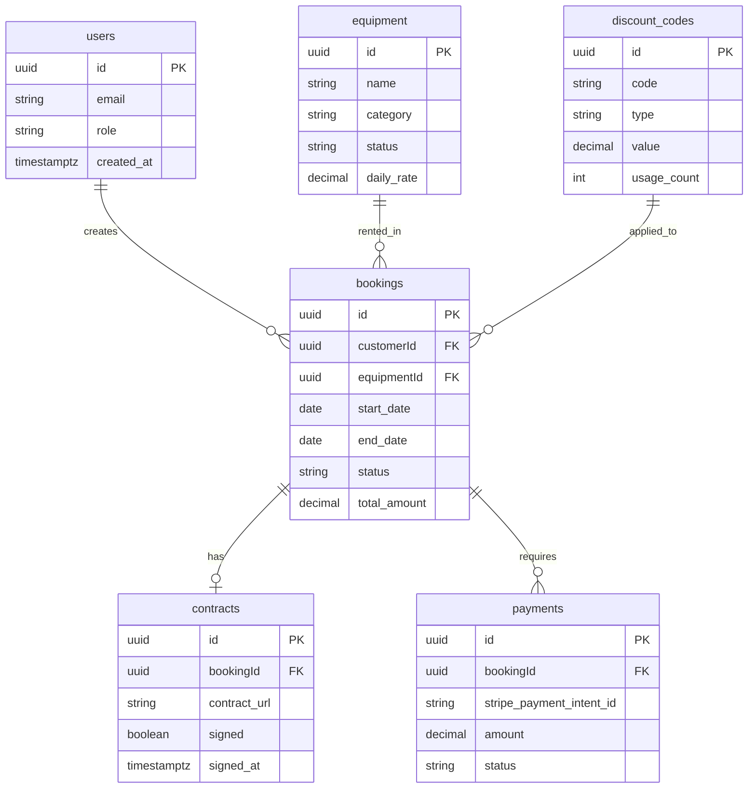

# 🗺️ Visual Codebase Maps

**Purpose**: Visual diagrams and maps for understanding U-Dig-It codebase architecture.

**Last Updated**: 2025-01-21

---

## 📐 System Architecture Overview

```
┌─────────────────────────────────────────────────────────────────┐
│                        U-Dig-It Platform                         │
│                    (Kubota Rental System)                        │
└─────────────────────────────────────────────────────────────────┘
                              │
        ┌─────────────────────┼─────────────────────┐
        │                     │                     │
   ┌────▼────┐          ┌─────▼─────┐        ┌─────▼─────┐
   │ Next.js │          │ Supabase  │        │  Stripe   │
   │Frontend │◄────────►│  Backend  │◄───────┤ Payments  │
   │Port 3000│          │PostgreSQL │        │   API     │
   └────┬────┘          └─────┬─────┘        └───────────┘
        │                     │
        │                ┌────▼────┐
        │                │SendGrid │
        │                │  Email  │
        └────────────────►└─────────┘
```

---

## 🗄️ Database Schema Visualization

### Core Tables Relationships



### Table Status Flow

```
Equipment Status Flow:
┌──────────┐    ┌───────────┐    ┌──────────┐    ┌─────────────┐
│Available │───►│ Reserved  │───►│  Rented  │───►│Maintenance  │
└──────────┘    └───────────┘    └──────────┘    └──────┬──────┘
      ▲                                                   │
      └───────────────────────────────────────────────────┘

Booking Status Flow:
┌─────────┐    ┌───────────┐    ┌──────────┐    ┌───────────┐
│ Pending │───►│ Confirmed │───►│  Active  │───►│ Completed │
└────┬────┘    └─────┬─────┘    └────┬─────┘    └───────────┘
     │               │               │
     │               │               │
     ▼               ▼               ▼
┌──────────┐    ┌──────────┐   ┌──────────┐
│Cancelled │    │Cancelled │   │Cancelled │
└──────────┘    └──────────┘   └──────────┘
```

---

## 🔄 API Request Flow

### Standard API Route Pattern (8 Steps)

```
Client Request
      │
      ▼
┌─────────────────────────────────────────────────────────────┐
│ Step 1: Rate Limiting                                       │
│ ├─ Check IP/User request count                             │
│ ├─ If exceeded → 429 Too Many Requests                     │
│ └─ If OK → Continue                                        │
└──────────────────────┬──────────────────────────────────────┘
                       ▼
┌─────────────────────────────────────────────────────────────┐
│ Step 2: Request Validation                                  │
│ ├─ Check Content-Type (application/json)                   │
│ ├─ Check Request Size (<10KB)                              │
│ └─ If invalid → 400 Bad Request                            │
└──────────────────────┬──────────────────────────────────────┘
                       ▼
┌─────────────────────────────────────────────────────────────┐
│ Step 3: Authentication                                      │
│ ├─ Extract JWT from cookies                                │
│ ├─ Verify with Supabase                                    │
│ └─ If invalid → 401 Unauthorized                           │
└──────────────────────┬──────────────────────────────────────┘
                       ▼
┌─────────────────────────────────────────────────────────────┐
│ Step 4: Input Sanitization                                  │
│ ├─ Strip HTML tags                                         │
│ ├─ Normalize whitespace                                     │
│ └─ Remove potentially dangerous content                     │
└──────────────────────┬──────────────────────────────────────┘
                       ▼
┌─────────────────────────────────────────────────────────────┐
│ Step 5: Zod Validation                                      │
│ ├─ Validate field types                                    │
│ ├─ Check constraints (min/max, patterns)                   │
│ └─ If invalid → 400 Bad Request with details               │
└──────────────────────┬──────────────────────────────────────┘
                       ▼
┌─────────────────────────────────────────────────────────────┐
│ Step 6: Business Logic                                      │
│ ├─ Check equipment availability                            │
│ ├─ Calculate pricing                                        │
│ ├─ Create booking record                                    │
│ └─ Process payment (if applicable)                          │
└──────────────────────┬──────────────────────────────────────┘
                       ▼
┌─────────────────────────────────────────────────────────────┐
│ Step 7: Structured Logging                                  │
│ ├─ Log success/failure                                     │
│ ├─ Include metadata (userId, bookingId)                    │
│ └─ Track performance metrics                                │
└──────────────────────┬──────────────────────────────────────┘
                       ▼
┌─────────────────────────────────────────────────────────────┐
│ Step 8: Response                                            │
│ ├─ Format response JSON                                    │
│ ├─ Set appropriate status code                             │
│ └─ Return to client                                         │
└──────────────────────┬──────────────────────────────────────┘
                       ▼
                Client Response
```

---

## 🎨 Component Hierarchy

### Application Component Tree

```
App (root layout)
│
├── Providers
│   ├── QueryClientProvider (TanStack Query)
│   ├── ThemeProvider (Tailwind)
│   └── ToastProvider (Notifications)
│
├── Navigation
│   ├── Logo
│   ├── MainMenu
│   │   ├── HomeLink
│   │   ├── EquipmentLink
│   │   ├── BookLink
│   │   └── AboutLink
│   ├── UserMenu (authenticated)
│   │   ├── DashboardLink
│   │   ├── ProfileLink
│   │   └── SignOutButton
│   └── MobileMenu (responsive)
│
├── Public Routes (no auth required)
│   │
│   ├── Home (/)
│   │   ├── HeroSection
│   │   ├── EquipmentShowcase
│   │   │   ├── EquipmentCard (repeated)
│   │   │   └── ViewMoreButton
│   │   ├── FeaturesSection
│   │   └── CallToAction
│   │
│   ├── Equipment (/equipment)
│   │   ├── FilterBar
│   │   ├── EquipmentGrid
│   │   │   └── EquipmentCard (repeated)
│   │   └── Pagination
│   │
│   ├── Contact (/contact)
│   │   └── ContactForm
│   │       ├── LeadCaptureForm
│   │       └── SubmitButton
│   │
│   └── Auth (/auth/*)
│       ├── SignIn
│       ├── SignUp
│       └── ResetPassword
│
├── Protected Routes (auth required)
│   │
│   ├── Dashboard (/dashboard)
│   │   ├── UserDashboard
│   │   │   ├── WelcomeBanner
│   │   │   ├── BookingSummary
│   │   │   ├── BookingList
│   │   │   │   └── BookingCard (repeated)
│   │   │   └── QuickActions
│   │   └── LoadingState
│   │
│   └── Booking Flow (/book/*)
│       ├── EquipmentSelection
│       ├── DateSelection
│       ├── AddOnsSelection
│       ├── PaymentSection
│       ├── InsuranceUpload
│       └── ContractSigning
│
└── Admin Routes (admin role required)
    │
    ├── AdminDashboard (/admin)
    │   ├── StatsOverview
    │   │   ├── RevenueCard
    │   │   ├── BookingsCard
    │   │   ├── EquipmentCard
    │   │   └── CustomersCard
    │   ├── RecentActivity
    │   └── QuickActions
    │
    ├── AdminBookings (/admin/bookings)
    │   ├── BookingFilters
    │   ├── BookingTable
    │   │   └── BookingRow (repeated)
    │   └── BookingDetailModal
    │
    ├── AdminEquipment (/admin/equipment)
    │   ├── EquipmentFilters
    │   ├── EquipmentTable
    │   └── EquipmentEditModal
    │
    └── AdminContracts (/admin/contracts)
        ├── ContractFilters
        ├── ContractTable
        └── ContractViewModal
```

---

## 🔐 Authentication & Authorization Flow

```
User Action (Page Load/API Call)
      │
      ▼
┌─────────────────┐
│ Check Session   │
│ (middleware)    │
└────────┬────────┘
         │
    ┌────┴────┐
    │ Exists? │
    └────┬────┘
         │
    ┌────▼────┐
    │   NO    │
    └────┬────┘
         │
    ┌────▼────────────┐
    │ Public Route?   │
    └────┬────────────┘
         │
    ┌────┴────┐
    │   NO    │──────► Redirect to /auth/signin
    └─────────┘
         │
    ┌────▼────┐
    │   YES   │──────► Allow Access
    └─────────┘

    From "Check Session":
    ┌────▼────┐
    │   YES   │
    └────┬────┘
         │
    ┌────▼────────────────┐
    │ Fetch User Profile  │
    │ (role, permissions) │
    └────────┬────────────┘
             │
        ┌────▼────────┐
        │ Admin Route?│
        └────┬────────┘
             │
        ┌────┴────┐
        │   YES   │
        └────┬────┘
             │
        ┌────▼───────────┐
        │ Is Admin Role? │
        └────┬───────────┘
             │
        ┌────┴────┐
        │   NO    │──────► 403 Forbidden
        └─────────┘
             │
        ┌────▼────┐
        │   YES   │──────► Allow Access
        └─────────┘

        From "Admin Route?":
        ┌────▼────┐
        │   NO    │──────► Allow Access
        └─────────┘
```

---

## 💳 Payment Flow Diagram

```
User Initiates Booking
      │
      ▼
┌─────────────────────────────────────┐
│ 1. Create Booking Record            │
│    Status: "pending"                │
└──────────────┬──────────────────────┘
               ▼
┌─────────────────────────────────────┐
│ 2. Calculate Total Amount           │
│    - Base rate × days               │
│    - + Add-ons (insurance, etc.)    │
│    - + Delivery fee                 │
│    - + HST (15%)                    │
└──────────────┬──────────────────────┘
               ▼
┌─────────────────────────────────────┐
│ 3. Create Stripe Payment Intent     │
│    Amount: total_amount (in cents)  │
│    Metadata: { booking_id }         │
└──────────────┬──────────────────────┘
               ▼
┌─────────────────────────────────────┐
│ 4. Return Client Secret to Frontend│
└──────────────┬──────────────────────┘
               ▼
┌─────────────────────────────────────┐
│ 5. User Enters Payment Details      │
│    (Stripe Elements)                │
└──────────────┬──────────────────────┘
               ▼
┌─────────────────────────────────────┐
│ 6. Stripe Processes Payment         │
└──────────────┬──────────────────────┘
               │
          ┌────┴────┐
          │ Success?│
          └────┬────┘
               │
          ┌────▼────┐
          │   YES   │
          └────┬────┘
               ▼
┌─────────────────────────────────────┐
│ 7. Stripe Webhook Triggered         │
│    Event: payment_intent.succeeded  │
└──────────────┬──────────────────────┘
               ▼
┌─────────────────────────────────────┐
│ 8. Update Booking Status            │
│    Status: "pending" → "confirmed"  │
│    (Using service role client)      │
└──────────────┬──────────────────────┘
               ▼
┌─────────────────────────────────────┐
│ 9. Send Confirmation Email          │
│    Via SendGrid                     │
└──────────────┬──────────────────────┘
               ▼
┌─────────────────────────────────────┐
│10. Generate Contract                │
│    PDF created & stored in S3       │
└──────────────┬──────────────────────┘
               ▼
      Booking Confirmed!

          From "Success?":
          ┌────▼────┐
          │   NO    │
          └────┬────┘
               ▼
┌─────────────────────────────────────┐
│ Payment Failed                      │
│ - Show error to user                │
│ - Keep booking as "pending"         │
│ - Allow retry                       │
└─────────────────────────────────────┘
```

---

## 📂 Directory Structure Visual

```
U-Dig-It/
│
├── frontend/                    # Next.js 16 Application
│   ├── src/
│   │   ├── app/                # App Router (Next.js 13+)
│   │   │   ├── (auth)/         # Auth group (layout)
│   │   │   │   ├── signin/
│   │   │   │   └── signup/
│   │   │   ├── (public)/       # Public group (layout)
│   │   │   │   ├── page.tsx    # Home
│   │   │   │   ├── equipment/
│   │   │   │   └── contact/
│   │   │   ├── (protected)/    # Protected group (layout)
│   │   │   │   ├── dashboard/
│   │   │   │   └── book/
│   │   │   ├── admin/          # Admin routes
│   │   │   │   ├── layout.tsx  # Admin layout
│   │   │   │   ├── page.tsx    # Admin dashboard
│   │   │   │   ├── bookings/
│   │   │   │   ├── equipment/
│   │   │   │   └── contracts/
│   │   │   └── api/            # API Routes
│   │   │       ├── bookings/
│   │   │       ├── equipment/
│   │   │       ├── stripe/
│   │   │       └── admin/
│   │   │
│   │   ├── components/         # React Components
│   │   │   ├── admin/         # Admin-specific
│   │   │   ├── auth/          # Auth components
│   │   │   ├── booking/       # Booking flow
│   │   │   ├── contracts/     # Contracts
│   │   │   ├── equipment/     # Equipment display
│   │   │   └── ui/            # Shared UI components
│   │   │
│   │   ├── lib/               # Utilities & Config
│   │   │   ├── supabase/
│   │   │   │   ├── client.ts  # Browser client
│   │   │   │   ├── server.ts  # Server client
│   │   │   │   └── admin.ts   # Service role client
│   │   │   ├── stripe.ts
│   │   │   ├── logger.ts
│   │   │   ├── rate-limiter.ts
│   │   │   └── input-sanitizer.ts
│   │   │
│   │   ├── hooks/             # Custom React hooks
│   │   │   ├── useBooking.ts
│   │   │   ├── useEquipment.ts
│   │   │   └── useAuth.ts
│   │   │
│   │   └── types/             # TypeScript types
│   │       ├── booking.ts
│   │       ├── equipment.ts
│   │       └── user.ts
│   │
│   └── public/                # Static assets
│       ├── images/
│       ├── fonts/
│       └── icons/
│
├── supabase/                  # Database & Backend
│   ├── migrations/            # SQL migrations
│   ├── functions/             # Edge functions (if any)
│   └── types.ts               # Generated TypeScript types
│
├── .cursor/                   # Cursor IDE Config
│   ├── rules/                 # AI coding rules
│   │   ├── *.mdc              # Always applied
│   │   ├── auto-reference-*.mdc  # Auto-attached
│   │   └── archive/           # Archived rules
│   └── indexing.json          # Indexing config
│
├── docs/                      # Documentation
│   ├── reference/             # Quick reference docs
│   ├── architecture/          # System architecture
│   ├── api/                   # API documentation
│   └── guides/                # Developer guides
│
└── scripts/                   # Utility scripts
    ├── start-frontend-clean.sh
    └── deploy-production.sh
```

---

## 🔄 Data Flow: Booking Creation

```
┌─────────────┐
│   Browser   │
│  (Client)   │
└──────┬──────┘
       │ 1. POST /api/bookings
       │    { equipmentId, startDate, endDate }
       ▼
┌──────────────────────────────────────┐
│   Next.js API Route                  │
│   /api/bookings/route.ts             │
│                                      │
│   ┌──────────────────────────────┐  │
│   │ Rate Limit → Validate →      │  │
│   │ Authenticate → Sanitize      │  │
│   └──────────────────────────────┘  │
└──────┬───────────────────────────────┘
       │ 2. Check availability
       ▼
┌──────────────────────────────────────┐
│   Supabase PostgreSQL                │
│                                      │
│   SELECT * FROM bookings             │
│   WHERE equipment_id = $1            │
│   AND daterange overlaps             │
└──────┬───────────────────────────────┘
       │ 3. Available ✓
       ▼
┌──────────────────────────────────────┐
│   Calculate Pricing                  │
│   - Base rate × days                 │
│   - + Add-ons                        │
│   - + Delivery fee                   │
│   - + HST (15%)                      │
└──────┬───────────────────────────────┘
       │ 4. Insert booking
       ▼
┌──────────────────────────────────────┐
│   Supabase PostgreSQL                │
│                                      │
│   INSERT INTO bookings               │
│   (customer_id, equipment_id, ...)   │
│   RETURNING id                       │
└──────┬───────────────────────────────┘
       │ 5. Booking created
       ▼
┌──────────────────────────────────────┐
│   Update Equipment Status            │
│                                      │
│   UPDATE equipment                   │
│   SET status = 'reserved'            │
│   WHERE id = $1                      │
└──────┬───────────────────────────────┘
       │ 6. Send notifications
       ▼
┌──────────────────────────────────────┐
│   SendGrid Email                     │
│   - Confirmation to customer         │
│   - Notification to admin            │
└──────┬───────────────────────────────┘
       │ 7. Return response
       ▼
┌──────────────────────────────────────┐
│   Browser (Client)                   │
│   - Show success message             │
│   - Redirect to payment              │
└──────────────────────────────────────┘
```

---

## 🛡️ Security Layers

```
┌─────────────────────────────────────────────────────────┐
│                     Security Layers                     │
└─────────────────────────────────────────────────────────┘

Layer 7: Application Security
├─ Input Validation (Zod schemas)
├─ Output Sanitization (DOMPurify)
├─ CSRF Protection (SameSite cookies)
└─ XSS Prevention (React auto-escaping)

Layer 6: Authentication & Authorization
├─ JWT Token Verification (Supabase Auth)
├─ Role-Based Access Control (RLS policies)
├─ Session Management (Secure cookies)
└─ Password Hashing (bcrypt)

Layer 5: API Security
├─ Rate Limiting (IP + User based)
├─ Request Size Limits (10KB)
├─ Content-Type Validation
└─ CORS Configuration

Layer 4: Database Security
├─ Row-Level Security (RLS)
├─ Parameterized Queries (SQL injection prevention)
├─ Service Role Key Protection
└─ Encrypted Connections (SSL/TLS)

Layer 3: Network Security
├─ HTTPS Only (TLS 1.3)
├─ Security Headers (CSP, HSTS, etc.)
├─ DDoS Protection (Vercel Edge)
└─ Firewall Rules (Supabase)

Layer 2: Infrastructure Security
├─ Environment Variable Encryption
├─ Secrets Management (Vercel/Supabase)
├─ Audit Logging (Supabase logs)
└─ Backup & Recovery

Layer 1: Monitoring & Response
├─ Security Scanning (pre-commit)
├─ Error Tracking (Structured logging)
├─ Incident Response (Emergency protocols)
└─ Performance Monitoring (Alerts)
```

---

## 📊 State Management Flow

```
┌──────────────────────────────────────┐
│        Component Renders             │
└──────────────┬───────────────────────┘
               │
               ▼
┌──────────────────────────────────────┐
│   TanStack Query Hook                │
│   useQuery({                         │
│     queryKey: ['bookings', userId],  │
│     queryFn: fetchBookings           │
│   })                                 │
└──────────────┬───────────────────────┘
               │
          ┌────▼────┐
          │ Cached? │
          └────┬────┘
               │
          ┌────▼────┐
          │   YES   │──────► Return Cached Data
          └─────────┘
               │
          ┌────▼────┐
          │   NO    │
          └────┬────┘
               ▼
┌──────────────────────────────────────┐
│   Fetch from API                     │
│   GET /api/bookings                  │
└──────────────┬───────────────────────┘
               ▼
┌──────────────────────────────────────┐
│   Query Supabase                     │
│   SELECT * FROM bookings             │
└──────────────┬───────────────────────┘
               ▼
┌──────────────────────────────────────┐
│   Cache Result                       │
│   staleTime: 30s                     │
│   cacheTime: 5min                    │
└──────────────┬───────────────────────┘
               ▼
┌──────────────────────────────────────┐
│   Render Component with Data         │
└──────────────────────────────────────┘

User Updates Data:
┌──────────────────────────────────────┐
│   useMutation({                      │
│     mutationFn: updateBooking        │
│   })                                 │
└──────────────┬───────────────────────┘
               ▼
┌──────────────────────────────────────┐
│   Optimistic Update (local)          │
│   - Update cache immediately         │
│   - Show loading state               │
└──────────────┬───────────────────────┘
               ▼
┌──────────────────────────────────────┐
│   Send API Request                   │
│   PUT /api/bookings/[id]             │
└──────────────┬───────────────────────┘
               │
          ┌────▼────┐
          │ Success?│
          └────┬────┘
               │
          ┌────▼────┐
          │   YES   │
          └────┬────┘
               ▼
┌──────────────────────────────────────┐
│   Invalidate & Refetch Queries       │
│   queryClient.invalidateQueries()    │
└──────────────┬───────────────────────┘
               ▼
┌──────────────────────────────────────┐
│   Re-render with Fresh Data          │
└──────────────────────────────────────┘

          From "Success?":
          ┌────▼────┐
          │   NO    │
          └────┬────┘
               ▼
┌──────────────────────────────────────┐
│   Rollback Optimistic Update         │
│   - Restore previous cache state     │
│   - Show error message               │
└──────────────────────────────────────┘
```

---

## ✅ Using Visual Maps

### For AI Model

When explaining code:
1. **Reference relevant diagram** for context
2. **Use visual flow** to explain logic
3. **Point to specific nodes** in diagrams

### For Developers

When planning features:
1. **Check architecture diagram** for system overview
2. **Review flow diagrams** for process understanding
3. **Update diagrams** when architecture changes

---

**Status**: ✅ Active Visual Reference
**Maintained By**: Development Team + AI
**Update When**: Architecture changes, new flows added

